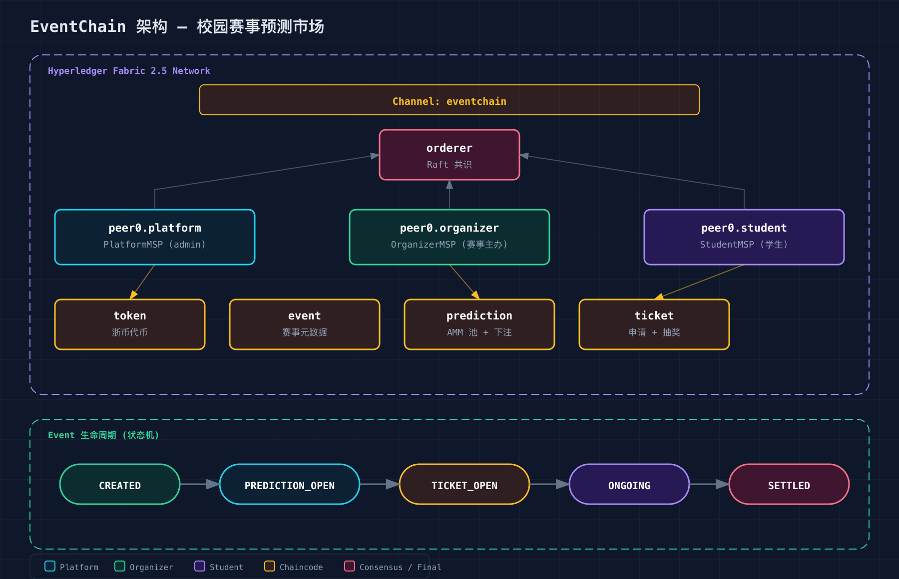
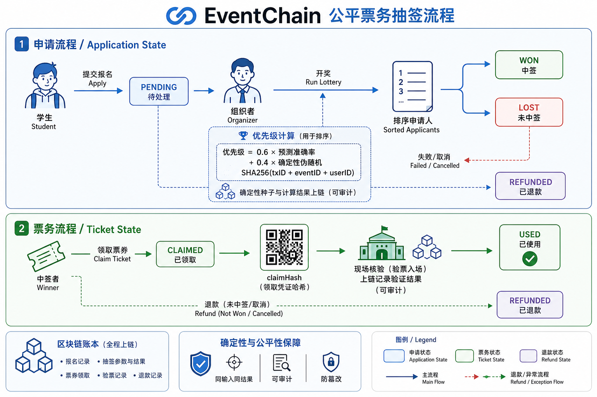

# EventChain V2

EventChain 是《区块链技术与实践》课程大作业：一个基于 Hyperledger Fabric 的校园体育积分 Demo，把运动积分、预测市场、活动抽签和服务兑换放在同一条链路中。

> A、B 和 P 都是封闭系统里的积分或仓位，不是法币、稳定币、加密货币或投资产品。本项目用于课程演示，不是生产系统。

## 1. 项目结构

    EventChain-For-ZJU/
    ├── client/                 Vue 3 + Vite 前端
    ├── server/                 Node.js + Express API、SQLite 登录数据
    ├── fabric/chaincode/       Go 链码源码
    │   ├── finance/             钱包、市场、订单、结算、挑战和 Claim
    │   └── activity/            活动、抽签、票据、二维码和签到
    ├── fabric/network/          Fabric 网络、通道和部署脚本
    ├── scripts/                 重置、启动、演示数据脚本
    ├── config/                  Fabric 配置
    └── install-fabric.sh        下载 Fabric CLI 和 Docker 镜像

### 区块链链路

- finance：A、B_paid、B_bonus、分类钱包、到期 lot、预测仓位、保证金、挑战/仲裁、7 天 Pending Claim、服务订单和赔付。
- activity：活动、独立验证者 commit–reveal 抽签、私有票据、30 秒动态二维码和签到回执。
- 钱包、lot、仓位、Claim、申请和票据写入 PlatformMSP + StudentMSP 私有数据集合；OrganizerMSP 不直接读取这些集合。
- 旧 token/event/prediction/ticket 链码保留在源码中用于课程对照，但 V2 部署不再使用；/api/v1 固定返回 HTTP 410。

## 2. 前端代码在哪里

前端根目录是 client/。需要修改页面文字时，优先编辑这些 Vue 文件：

| 文件 | 页面 |
|---|---|
| client/src/views/HomeView.vue | 赛事市场首页 |
| client/src/views/EventDetailView.vue | 单个赛事市场详情 |
| client/src/views/TicketHallView.vue | 票务大厅 |
| client/src/views/ServicesV2View.vue | 服务兑换 |
| client/src/views/WalletV2View.vue | A / B 钱包 |
| client/src/views/ProfileView.vue | 我的个人中心 |
| client/src/views/LoginView.vue | 登录页 |
| client/src/views/AdminView.vue | 运营台 |

公共文字和样式：

- client/src/components/：导航栏、按钮、卡片、状态标签、二维码等公共组件。
- client/src/assets/styles/global.css：全局布局、响应式规则和 Element Plus 覆盖。
- client/src/assets/styles/variables.css：颜色、字体、圆角和间距变量。
- client/src/utils/display.js：角色、状态、积分桶和服务类型的中文显示名称。
- client/src/router/index.js：页面路由。
- client/src/stores/：登录、活动和财务状态。
- client/src/api/index.js：前端请求 API 的统一入口。

修改文字后，Vite 开发服务器会自动刷新；不要直接修改 dist/，它是构建产物。

## 3. 运行前提

推荐环境是 Windows + Docker Desktop + WSL2 Ubuntu。仓库脚本应在 WSL2 Bash 中执行，不要混用 Windows PowerShell 的路径和 WSL 内的 Fabric 证书路径。

| 依赖 | 要求 |
|---|---|
| Docker | Docker Desktop，启用 WSL2 backend 和 Ubuntu integration |
| Node.js | 22.x（项目支持 >=22 <25） |
| Go | 1.21 或更高版本 |
| Fabric CLI | Fabric 2.5.15，Fabric CA 1.5.17 |
| 命令行工具 | Bash、Docker Compose v2、jq、curl |

确认 Docker 和 Node 可用：

    docker info
    node --version

首次克隆后，在仓库根目录下载当前系统架构的 Fabric 工具和镜像：

    cd ~/EventChain-For-ZJU
    ./install-fabric.sh binary docker --fabric-version 2.5.15 --ca-version 1.5.17
    ./bin/peer version
    ./bin/fabric-ca-client version
    docker images | grep hyperledger/fabric

不要把 macOS 的 Mach-O 二进制复制到 WSL2；file bin/peer 应显示 Linux ELF 64-bit。Peer 编译链码还需要 hyperledger/fabric-ccenv:2.5 和 hyperledger/fabric-baseos:2.5 镜像。

## 4. 首次启动：清空并重建本地 Demo

reset-v2.sh --yes 会删除本地账本、CA 状态、生成的身份、服务端钱包和 SQLite Demo 用户。只有首次初始化或明确要重置数据时才运行。

### 终端 1：重置 Fabric 网络

    cd ~/EventChain-For-ZJU
    ./scripts/reset-v2.sh --yes

脚本会依次执行网络清理、启动、创建通道和部署 V2 链码。完成后不要重复执行 createChannel 或 deployCCs。

### 终端 2：启动后端

    cd ~/EventChain-For-ZJU/server
    cp .env.example .env       # 第一次运行时执行；已有 .env 可跳过
    npm install
    npm start

看到 server listening 后，后端 API 已在 http://127.0.0.1:3000 监听。

### 终端 3：写入演示数据

    cd ~/EventChain-For-ZJU
    ./scripts/seed-data.sh

### 终端 4：启动前端

    cd ~/EventChain-For-ZJU/client
    npm install
    npm run dev -- --host 127.0.0.1

浏览器打开 http://localhost:5173/login。

也可以使用 ./scripts/start-all.sh 一键启动网络、后端和前端，但它不会替代首次 reset-v2.sh --yes，也不会自动写入演示数据。

## 5. 恢复已有账本

只是重启 Docker Desktop 或退出容器时，不要运行 reset，也不要重新注册身份。先在 WSL2 中启动已有容器：

    cd ~/EventChain-For-ZJU/fabric/network
    docker compose --env-file docker/.env -f docker/docker-compose-ca.yaml up -d
    docker compose --env-file docker/.env -f docker/docker-compose-net.yaml up -d

然后按“启动后端”和“启动前端”两节运行服务。验证接口和 Peer：

    curl http://127.0.0.1:3000/api/health
    ss -ltn | grep -E '7051|9051|11051'

普通停止时使用 docker compose ... stop，不要使用 network.sh down，后者会清理 volumes、证书和通道产物。

## 6. 演示账号和使用流程

演示数据由 scripts/seed-data.sh 创建：

- 学生：3220100001–3220100005，密码均为 eventchain-student-2026。
- 管理员：admin01 / eventchain-admin-2026。
- 组织者：organizer01 / eventchain-organizer-2026。
- 运营员：operator01 / eventchain-operator-2026。
- 验证员：verifier01 / eventchain-verifier-2026。
- 仲裁员：arb01–arb03，密码分别为 eventchain-arb01-2026–eventchain-arb03-2026。

主要页面：

| 地址 | 功能 |
|---|---|
| / | 赛事市场、公开概率快照和近期活动 |
| /event/:marketId | 市场详情、建立仓位、挑战和领取待成熟收益 |
| /tickets | 活动报名、抽签状态、私密票据和动态二维码 |
| /services | 使用 B_paid 兑换场馆、器材或活动服务 |
| /wallet | 分类钱包、兑换、兑回和转让 |
| /me | 个人资产、隐私边界、申请和积分生命周期 |
| /admin | 按证书角色执行创建、状态推进、结算和仲裁 |

票务抽签采用验证者先提交承诺、截止后揭示种子的 commit–reveal 流程：

## 7. 默认业务规则

| 项目 | 默认值 |
|---|---:|
| B_paid 兑回费 | 0.5% |
| 市场结算费 | 1%（组织者/风险准备金/销毁 = 60/30/10） |
| B_paid / B_bonus 到期 | 365 / 90 天 |
| 转让限额 | 500 B_paid/日、最多 5 个收款方、24h 冷却 |
| 单用户 / 风险组敞口 | 市场上限 5% / 10% |
| 结果挑战期 | 24h |
| Claim 可回滚期 | 7 天 |
| Claim 批处理 | 每页 100、并发 5、16 个逻辑 escrow shard |
| 服务取消赔付 | 默认 1.2×，最高 1.5×，必须预存保证金 |

每个预测市场只能使用 B_paid 或 B_bonus 其中一个积分桶，默认使用 B_bonus。无胜方、无人命中或强制 void 时原额退款且不收费。

## 8. 端口和配置

普通用户只需要访问前端；Fabric 端口由后端和部署脚本使用。

| 服务 | 默认端口 | 用途 |
|---|---:|---|
| Vue/Vite | 5173 | 浏览器入口 |
| Express API | 3000 | 前端 REST API |
| Platform / Organizer / Student Peer | 7051 / 9051 / 11051 | 后端 Gateway 连接 |
| Orderer | 7050 | 通道和排序服务 |
| Platform / Organizer / Student / Orderer CA | 7054 / 8054 / 9054 / 10054 | 注册和签发身份 |
| CouchDB | 5984 / 7984 / 9984 | 本地调试数据库 |

复制 server/.env.example 为 server/.env 后，可调整：

- PORT：Express 监听端口。
- CORS_ORIGINS：允许访问 API 的前端来源，英文逗号分隔。
- JSON_LIMIT：JSON 请求体大小，默认 256kb。
- GATEWAY_CACHE_TTL_MS：闲置 Fabric Gateway 的回收时间，默认 10 分钟。
- CLAIM_WORKER_*：待成熟收益处理任务的周期、并发和分页大小。
- 各组织的 Peer/CA 地址和 TLS 证书路径：后端运行在宿主机时必须与 WSL2/Docker 暴露端口一致。

如果 3000 端口被占用，后端和前端代理必须一起修改：

    # 后端
    cd ~/EventChain-For-ZJU/server
    PORT=3001 npm start

    # 前端
    cd ~/EventChain-For-ZJU/client
    EVENTCHAIN_API_TARGET=http://127.0.0.1:3001 npm run dev -- --host 127.0.0.1

## 9. 测试和代码检查

    cd ~/EventChain-For-ZJU

    for d in fabric/chaincode/{token,event,prediction,ticket,finance,activity}; do
      (cd "$d" && env -u GOROOT go test ./... && env -u GOROOT go vet ./...)
    done

    npm test --prefix server
    npm run build --prefix client

如果 Go 报 go1.xx does not match go tool version go1.yy，说明当前 shell 的 GOROOT 指向了另一套 Go：

    unset GOROOT
    go version
    go env GOROOT

## 10. 常见问题

### npm error ENOENT ... /home/qkl/package.json

命令是在 WSL 家目录运行的，而不是项目目录。先进入正确目录：

    cd ~/EventChain-For-ZJU/server   # 后端
    cd ~/EventChain-For-ZJU/client   # 前端

不要在 ~/ 下执行 npm install 或 npm start。

### ECONNREFUSED 127.0.0.1:7054

后端连接不到 Platform CA。确认 Fabric CA 容器已启动、7054 端口正在监听，再启动后端：

    docker ps
    ss -ltn | grep 7054

### No such image: hyperledger/fabric-ccenv:2.5

本地没有链码构建镜像。重新下载镜像后再部署：

    cd ~/EventChain-For-ZJU
    ./install-fabric.sh docker --fabric-version 2.5.15 --ca-version 1.5.17

### cannot execute binary file: Exec format error

Fabric CLI 架构不匹配。删除本地 bin 中的错误版本，并在当前 WSL2 Ubuntu 内重新执行 install-fabric.sh binary。

### 登录成功，但市场/钱包请求失败

登录数据在 SQLite，业务数据在 Fabric。检查 Peer 端口 7051、9051、11051、链码容器和后端日志。

### Identity ... is already registered

CA 中已有该身份。想保留账本时按“恢复已有账本”启动；只有确认要清空本地数据时才运行 ./scripts/reset-v2.sh --yes。

## 11. 隐私和课程 Demo 边界

- 学号只在服务端以 HMAC 查找键和 AES-256-GCM 密文保存，链上身份使用随机 acct_... 编号。
- 公开市场只展示五分钟延迟、取整后的概率和资金快照，不展示个人下注记录、精确仓位或“聪明钱”排行榜。
- Fabric 私有数据是组织级隐私，不是零知识证明；拥有相应 Peer 管理权限的节点管理员仍属于信任边界。
- 课程 Demo 的限额、身份名单和密钥不等同于生产级 KYC、反洗钱、审计或消费者保护方案。
