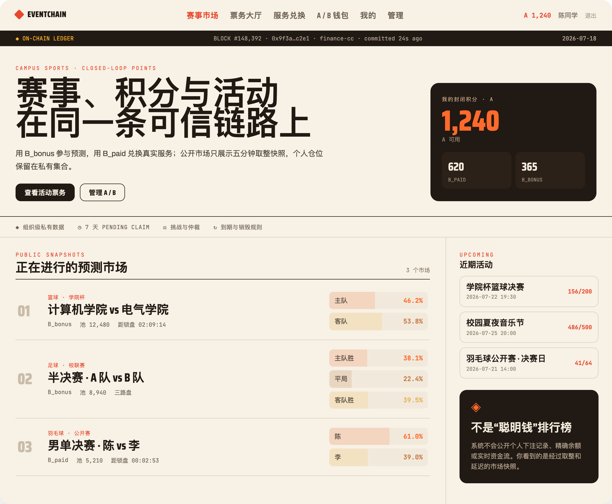
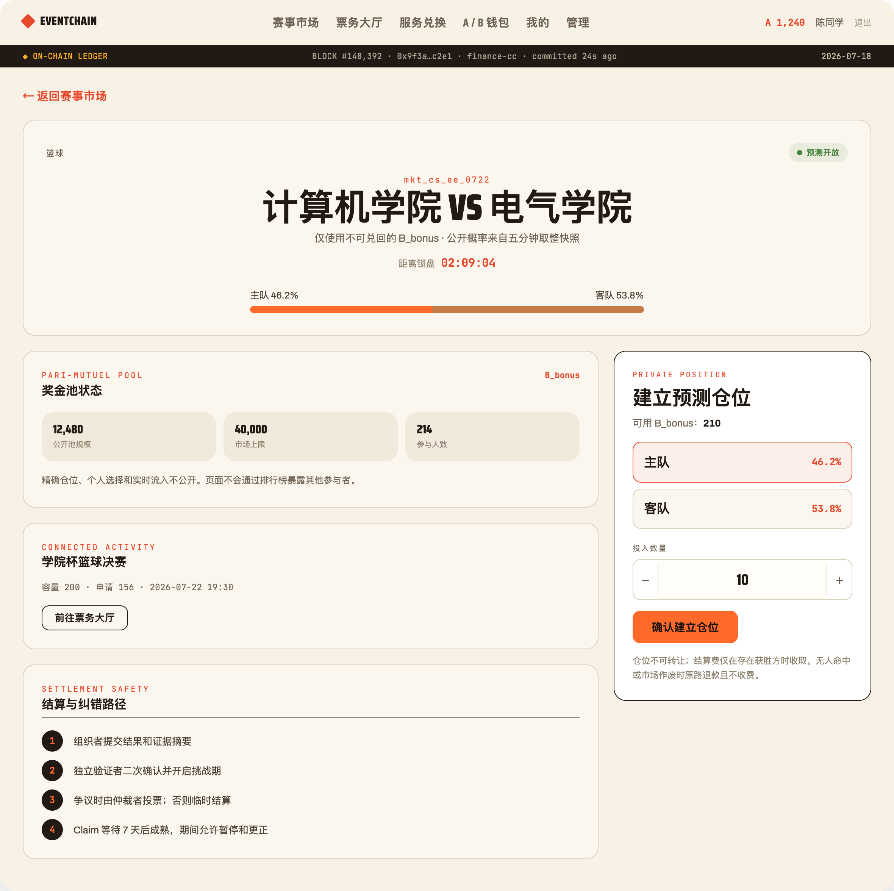
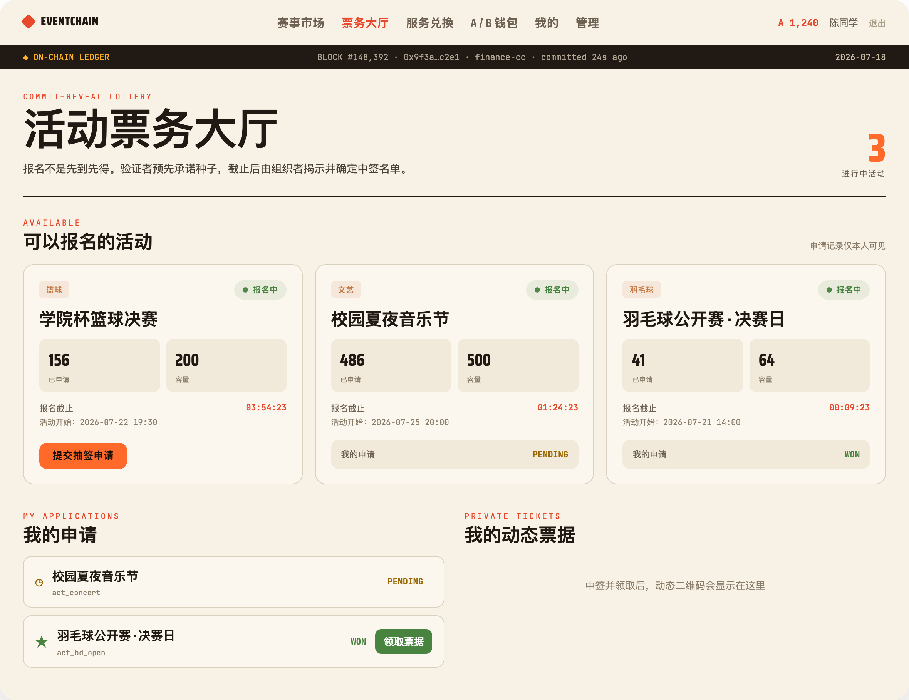
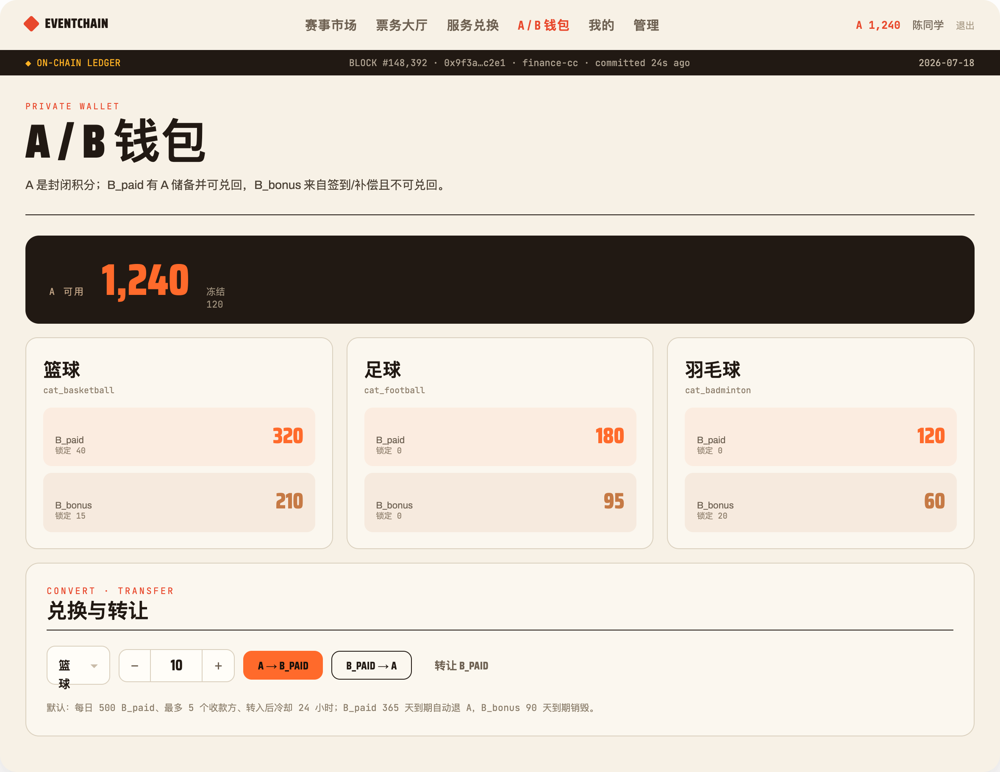

# EventChain V2

课程 Demo 版运动积分、服务兑换、预测市场与活动票务系统。A/B/P 均为封闭积分或链上仓位，不是法币、稳定币、加密货币或投资产品。

## V2 模型

- `A`：主积分，仅在封闭系统内使用。
- `B_paid(category)`：A 以 1:1 兑换的运动类别积分，有 A 储备，可转让、退款、到期退 A、扣 0.5% 手续费后兑回 A。
- `B_bonus(category)`：签到、延期补偿和 Demo 发放的奖励积分，不可转让、不可兑回，90 天到期销毁。
- `P(market,outcome,bucket)`：预测仓位。每个市场只能使用 `B_paid` 或 `B_bonus` 一种桶；默认 `B_bonus`。

链上只部署两个 V2 chaincode：

- `finance`：钱包、lot/到期、市场、保证金、挑战/仲裁、7 天 Pending Claim、服务订单与赔付。
- `activity`：活动、独立验证者 commit–reveal 抽签、私密票据、30 秒 QR 证明和签到回执。

旧 `token/event/prediction/ticket` 不再部署，`/api/v1` 固定返回 HTTP 410。

## 融合后的前端

前端保留原信息架构，视觉已切换为暖纸张与墨色的 On-Chain Broadsheet 设计系统；所有数据和操作均已迁移到 `/api/v2`：

- `/`：赛事市场首页，同时显示用户 A/B 概览、公开赔率快照和近期活动。
- `/event/:marketId`：赛事详情、N 结果概率、私有仓位、挑战和 Pending Claim。
- `/tickets`：commit–reveal 报名、抽签状态、私密票据与 30 秒动态 QR。
- `/services`、`/wallet`、`/me`：服务兑换、分类钱包和隐私化个人中心。
- `/admin`：按 organizer/verifier/operator/arbitrator/admin 证书角色显示运营动作。

### 界面展示

<table>
  <tr>
    <td width="50%" align="center">
      
      <br /><strong>赛事市场</strong>
    </td>
    <td width="50%" align="center">
      
      <br /><strong>赛事详情与预测仓位</strong>
    </td>
  </tr>
  <tr>
    <td width="50%" align="center">
      
      <br /><strong>活动票务大厅</strong>
    </td>
    <td width="50%" align="center">
      
      <br /><strong>A/B 分类钱包</strong>
    </td>
  </tr>
</table>

### 门票抽签流程


已移除依赖 V1 API 的旧 stores、虚构赔率历史、个人下注排行榜以及早期重复的 V2 替代页；公开页面只显示账本提供的真实快照。

## 关键默认值

| 项目 | 默认值 |
|---|---:|
| B_paid 兑回费 | 0.5% |
| 市场结算费 | 1%（组织者/风险准备金/销毁 = 60/30/10） |
| B_paid / B_bonus 到期 | 365 / 90 天 |
| 转让限额 | 500 B_paid/日、5 个收款方、24h 冷却 |
| 单用户 / 风险组敞口 | 市场上限 5% / 10% |
| 结果挑战期 | 24h |
| Claim 可回滚期 | 7 天 |
| Claim 批处理 | 每页 100、并发 5、16 个逻辑 escrow shard |
| 服务取消赔付 | 默认 1.2×，最高 1.5×，必须预存保证金 |
| 延期 B_bonus 补偿 | 3–7 天 5%，8–14 天 10%，15 天以上 15% |

无胜方、无人命中或强制 void 时原额退款且不收费。错误结算只能在 fee 激活前由 3 人应急名单中的 2 人批准后替换 epoch；已成熟余额不做负数回滚。

## 本地运行与部署条件

这是课程 Demo 的本地部署流程，不是生产部署方案。生产环境还需要 HTTPS、外部身份源、密钥/HSM、持久化备份、共享限流、监控和多节点治理。

### 前置条件

| 依赖 | 要求 |
|---|---|
| 容器运行时 | macOS/Linux 使用 OrbStack 或 Docker Desktop；Windows 使用 Docker Desktop 的 WSL2 backend |
| Node.js | 22.x（项目声明支持 `>=22 <25`） |
| Go | 用于编译 `finance` 和 `activity` chaincode |
| Fabric 工具 | Fabric 2.5 CLI 与 Fabric CA Client；仓库脚本从 `fabric/network/bin` 查找命令 |
| 命令行工具 | Bash、Docker Compose v2、`jq`、`curl` |

启动前应确认 Docker 可用：

```bash
docker info
```

### 服务端口

普通浏览器用户只需要访问前端入口，不需要配置 Fabric 端口。

#### 用户与应用入口

| 服务 | 默认端口 | 用途 |
|---|---:|---|
| Vue/Vite 前端 | 5173 | 浏览器访问入口 |
| Express API | 3000（冲突时可改为 3001） | 前端调用的 REST API |

#### Fabric 基础设施

| 服务 | 端口 | 宿主机用途 |
|---|---:|---|
| Platform / Organizer / Student Peer | 7051 / 9051 / 11051 | 当前后端运行在宿主机，需要按用户组织连接对应 Gateway |
| Orderer / Admin | 7050 / 7053 | 创建通道、部署或升级 chaincode 时使用 |
| Platform / Organizer / Student / Orderer CA | 7054 / 8054 / 9054 / 10054 | 注册和签发 Fabric 身份时使用 |
| CouchDB | 5984 / 7984 / 9984 | 仅用于本地调试，不是应用入口 |

这些端口不是给终端用户选择的业务配置。当前本地开发模式需要把 Peer 暴露给宿主机上的 Node.js 后端；如果后续把后端也容器化并加入 `eventchain_network`，Peer、Orderer、CA 和 CouchDB 都可以只留在 Docker 内网。

生产部署通常只对外暴露反向代理的 `80/443`，前端和 API 由反向代理转发；Fabric 基础设施端口应由内网和防火墙隔离，不应直接暴露到公网。

如果 `3000` 已被其他程序占用，后端与前端代理必须一起改：

```bash
# 终端 1：后端
cd server
PORT=3001 npm start

# 终端 2：前端
cd client
EVENTCHAIN_API_TARGET=http://127.0.0.1:3001 npm run dev -- --host 127.0.0.1
```

### macOS / Linux：首次初始化

`reset-v2.sh` 会删除本地 Fabric 账本、CA 状态、身份钱包和 Demo 用户。仅在首次初始化，或明确接受清空数据时运行：

```bash
cd /path/to/EventChain
./scripts/reset-v2.sh --yes

cd fabric/network
./network.sh up
./network.sh createChannel
./network.sh deployCCs

cd ../../server
npm install
PORT=3001 npm start
```

后端启动后，在新终端写入 Demo 数据并启动前端：

```bash
cd /path/to/EventChain
./scripts/seed-data.sh

cd client
npm install
EVENTCHAIN_API_TARGET=http://127.0.0.1:3001 npm run dev -- --host 127.0.0.1
```

打开 <http://127.0.0.1:5173/login>。Demo 学生账号为 `3220100001`–`3220100005`，密码均为 `eventchain-student-2026`。

### macOS / Linux：恢复已有账本

如果只是退出了 OrbStack/Docker Desktop，且 `fabric/network/organizations` 和 Docker volumes 仍在，不要运行 `reset-v2.sh`，也不需要重新注册身份。启动已有容器：

```bash
cd /path/to/EventChain/fabric/network
docker compose --env-file docker/.env -f docker/docker-compose-ca.yaml up -d
docker compose --env-file docker/.env -f docker/docker-compose-net.yaml up -d
```

随后按上面的端口配置启动后端与前端。验证：

```bash
curl http://127.0.0.1:3001/api/health
lsof -nP -iTCP:7051 -iTCP:9051 -iTCP:11051 -sTCP:LISTEN
```

### Windows

Windows 推荐并支持的路径是 **WSL2**，不建议直接在 CMD 或 PowerShell 中运行 Fabric 脚本。`network.sh`、证书权限、软链接和 Docker bind mounts 都按 Unix/Bash 语义编写。

1. 安装 Docker Desktop，启用 **Use the WSL 2 based engine**。
2. 在 Docker Desktop 中为使用的 WSL 发行版开启 integration。
3. 在 WSL2 内安装 Node.js 22、Go、`jq`、`curl` 和 Fabric 2.5 CLI。
4. 将仓库克隆到 WSL 文件系统，例如 `~/EventChain`，避免放在 `/mnt/c` 下造成权限和 I/O 问题。
5. 在 WSL2 Bash 中执行上面的 macOS/Linux 命令。
6. Windows 浏览器可直接打开 <http://localhost:5173/login>。

不要把 Fabric 网络运行在 WSL2、后端运行在 Windows PowerShell，再混用两套 `localhost` 和文件路径；这会让 TLS 证书路径与 Gateway 地址难以保持一致。

### 常见启动错误

- `14 UNAVAILABLE` / `ECONNREFUSED 127.0.0.1:11051`：Student Peer 没有监听。先检查 Docker，再启动或恢复 Fabric 容器。
- 登录接口返回 404，但 `3000` 有进程：该端口可能属于其他应用。使用 `lsof -nP -iTCP:3000 -sTCP:LISTEN` 确认，并通过 `PORT` 与 `EVENTCHAIN_API_TARGET` 成对改端口。
- `Identity 'peer0' is already registered`：CA 数据与已有身份仍存在。若要保留账本，使用“恢复已有账本”的 Docker Compose 命令；若确定重建，才运行 `reset-v2.sh --yes`。
- 登录成功但市场、钱包请求失败：认证只依赖 SQLite；业务数据依赖 Fabric。检查 `7051`、`9051`、`11051` 和 chaincode 容器。

## 测试

```bash
for d in fabric/chaincode/{token,event,prediction,ticket,finance,activity}; do
  (cd "$d" && go test ./...)
done

npm test --prefix server
npm run build --prefix client
```

## 隐私与剩余边界

- CA 证书只含随机 `acct_...` 和角色属性，学号只在 SQLite 中以 HMAC 查找键和 AES-256-GCM 密文保存。
- 钱包、lot、仓位、claim、申请和票据存于 PlatformMSP + StudentMSP PDC；OrganizerMSP 没有这些 collection。
- 普通组织者看不到“聪明钱”账户，但 Platform/Student 组织的 peer 管理员仍能读取其 PDC。这是 Fabric 组织级隐私边界，不是对 peer 管理员的零知识隐私。
- 签到与奖励是幂等 saga：票据核销成功而奖励超时时，重复同一证明会返回原签到回执并安全重试奖励。
- 课程 Demo 的限额和名单不是生产级 KYC、反洗钱或内幕交易监控。若走向真实可兑价值，必须重新做法律定性、许可、税务、消费者保护、审计和密钥治理。
